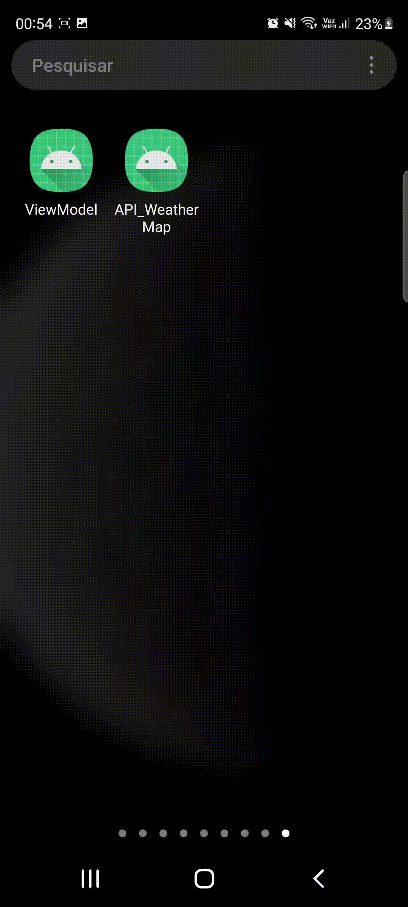
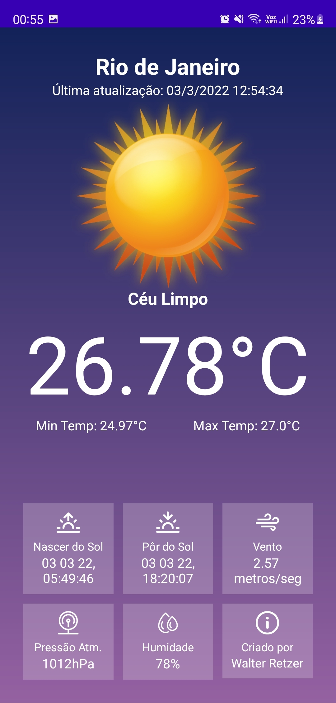
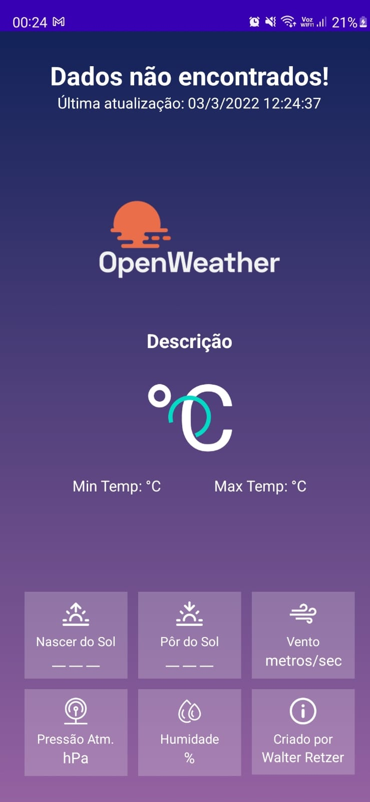
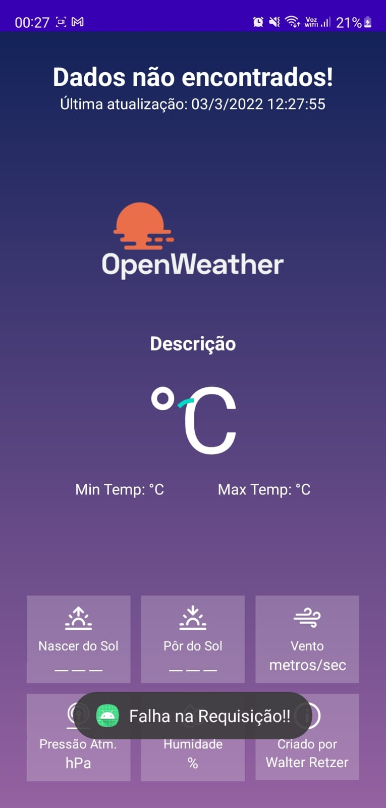

# API_OpenWeatherMap
APP com Informações meteorológicas da API CurrentWeatherData, para mostrar um exemplo utilizando a biblioteca Retrofit, conceitos de MVVM e Kotlin.

## GRAVAÇÃO DA TELA DO APLICATIVO

## TELA DO APLICATIVO COM INFORMAÇÕES DO CLIMA EM PORTUGUÊS-BR

### Exibição caso ocorra falha na requisição da API

