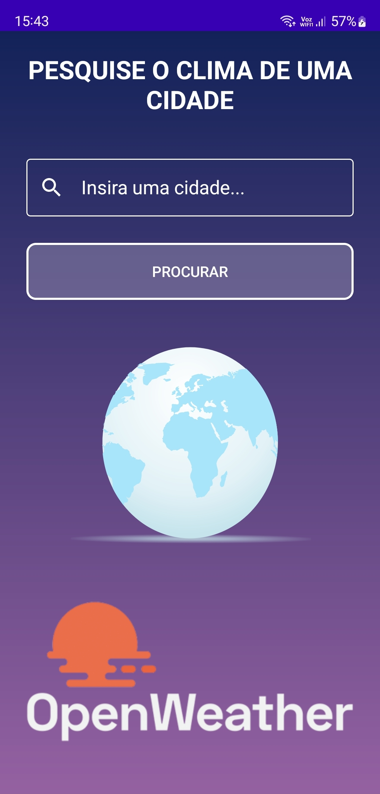
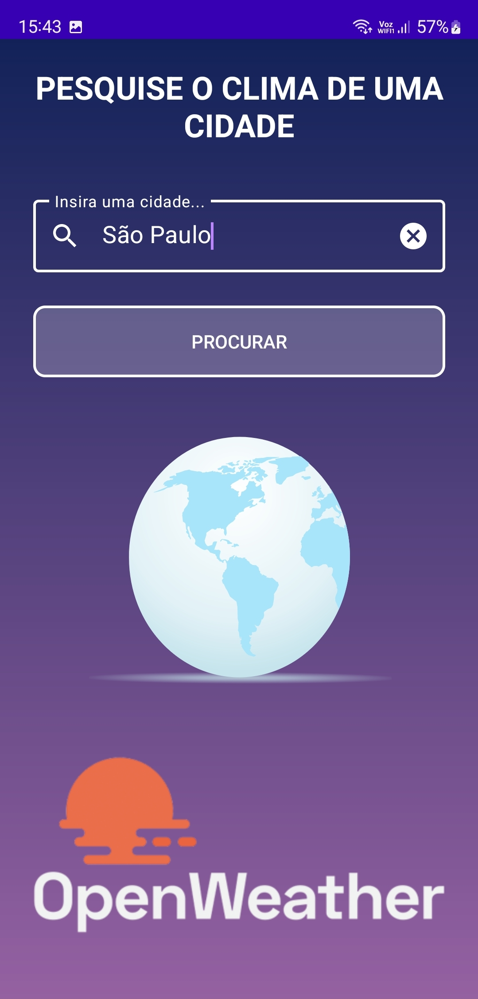
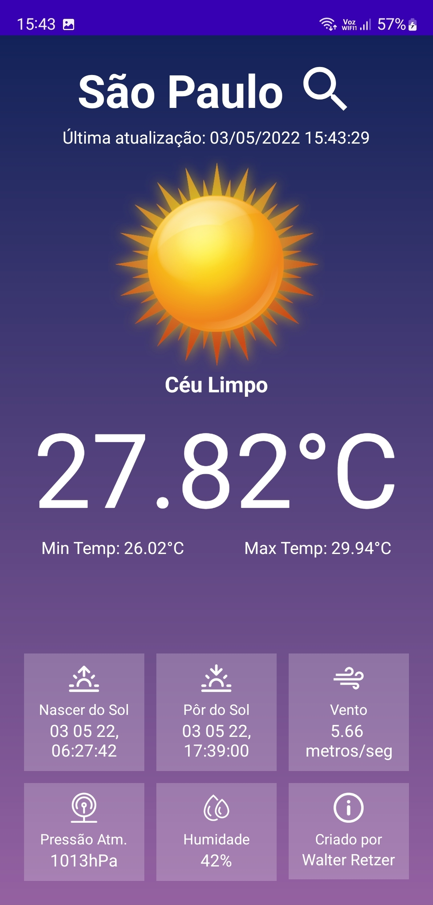
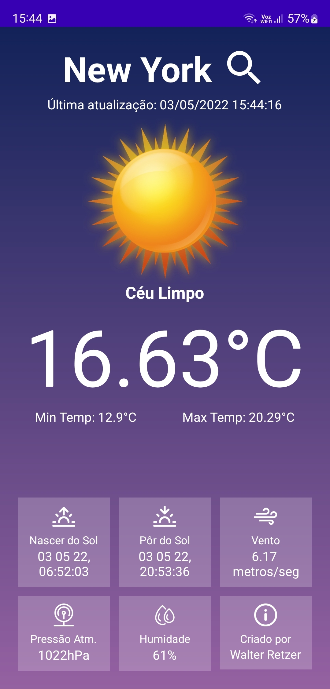
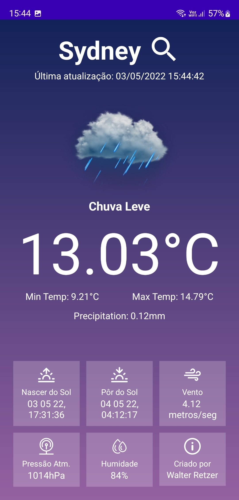
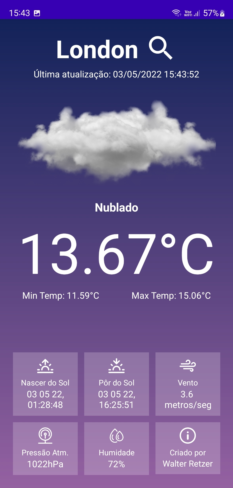
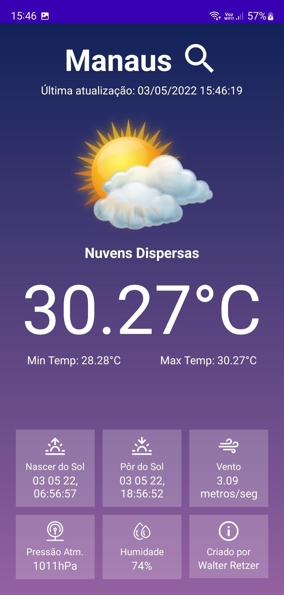
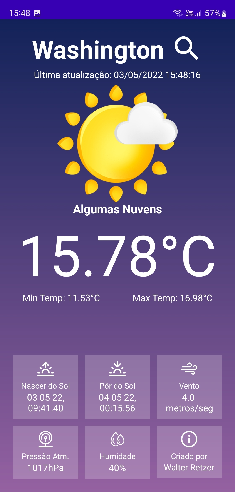

# API_OpenWeatherMap
Aplicativo consumindo Informações meteorológicas da API CurrentWeatherData, utilizando a biblioteca Retrofit, conceitos de MVVM e Kotlin.
Tela de Abertura com animações utilizando a biblioteca Lottie.

## GRAVAÇÃO DA TELA DO APLICATIVO

## TELA DE ABERTURA DO APLICATIVO

## TELA DE PESQUISA

## TELA DO APLICATIVO COM INFORMAÇÕES DO CLIMA EM PORTUGUÊS-BR

## Exibição caso ocorra falha na requisição da API

